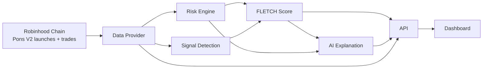
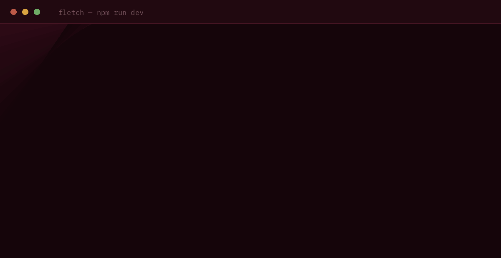
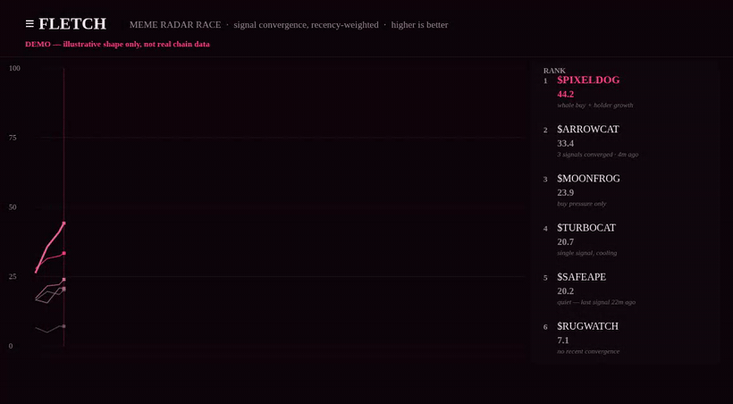
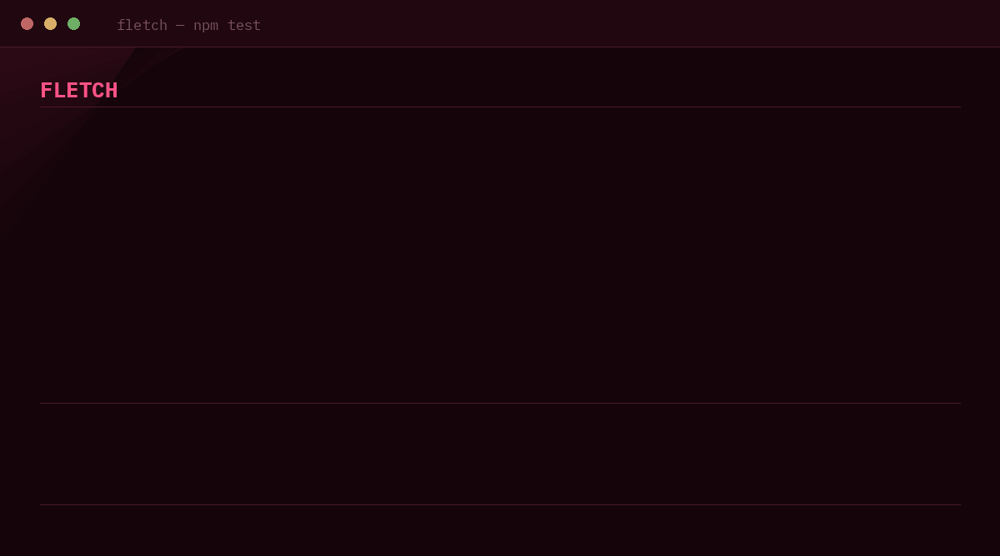
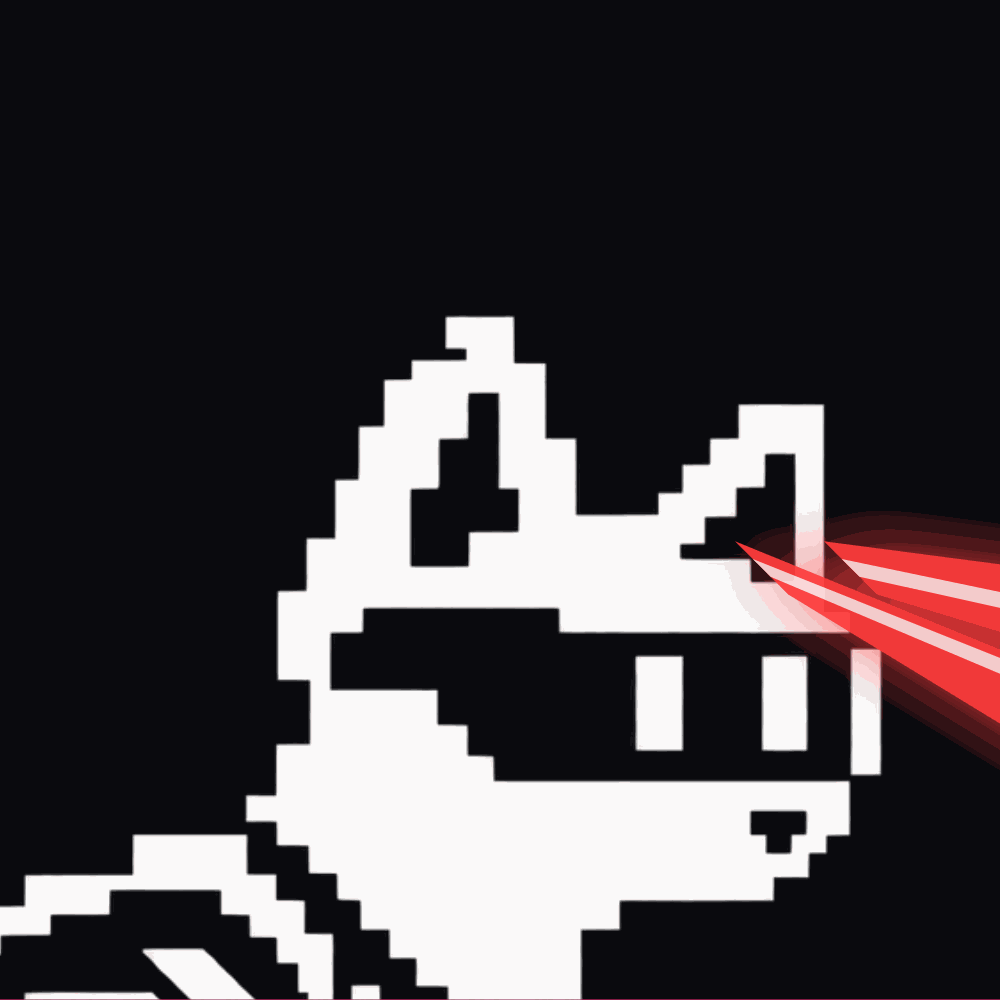
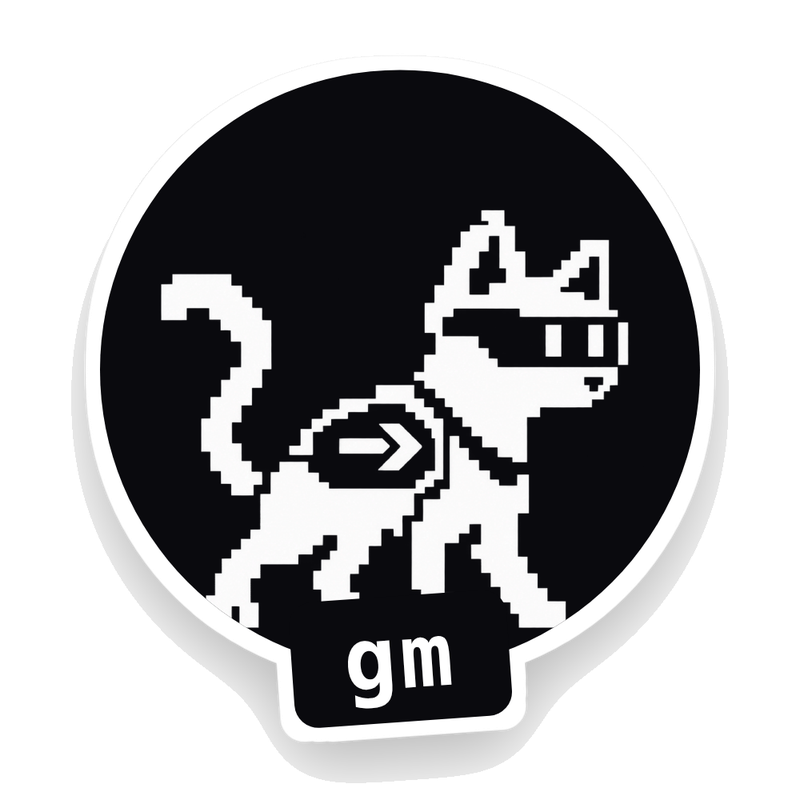
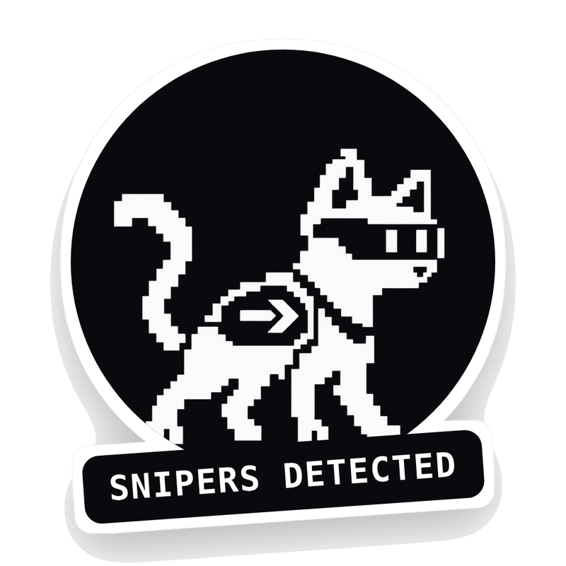
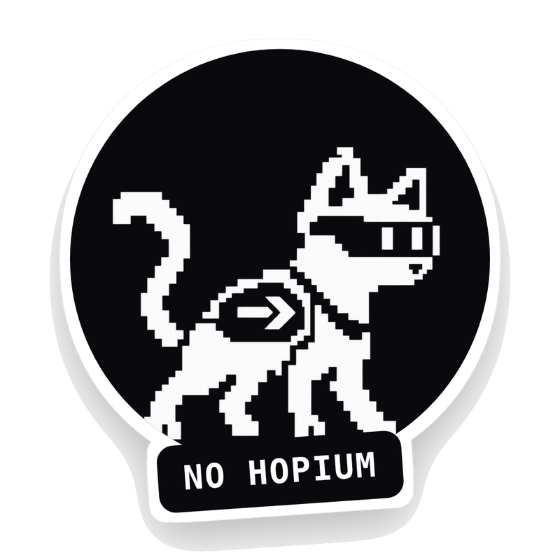
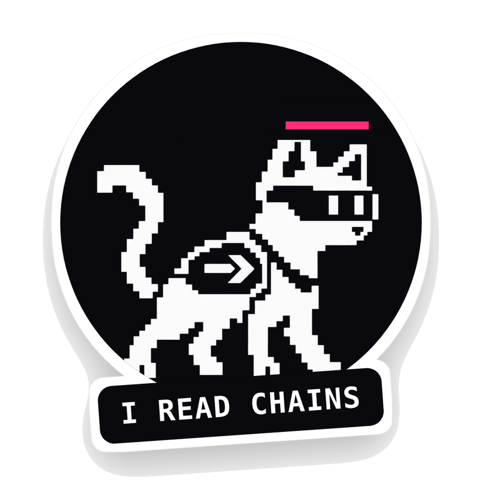
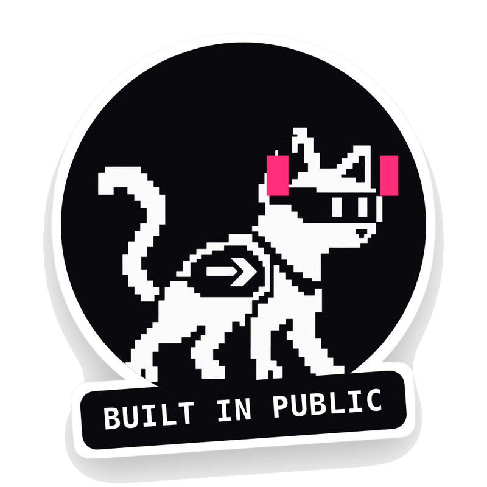

<p align="center">
  
</p>

<p align="center">
  <a href="https://github.com/leopardracer/FLETCH/actions/workflows/ci.yml"></a>
  
  
  
  
  
  
  
</p>

<p align="center"><b>The meme moves first. FLETCH tells you why.</b></p>

<p align="center"><a href="https://app.getfletch.xyz"><b>Launch the app → app.getfletch.xyz</b></a> · <a href="https://getfletch.xyz">getfletch.xyz</a></p>

---

Meme tokens on Robinhood Chain launch by the thousand, and most of what "moves" is noise. FLETCH is the intelligence layer that reads the chain directly — launches, trades, holders, liquidity, deployer behavior — and turns it into three plain-English answers: what's happening, why, and whether it's worth your attention. Every number is either a real chain read or explicitly marked `unavailable`. Nothing here is a fabricated demo dressed up as a live product.

FLETCH is **not** a token screener, a trading bot, or a price predictor. There is no execution path in this repository — an optional, read-only chat agent exists (off by default, see [docs/AI.md](./docs/AI.md)), but it can only report what FLETCH's own deterministic engine already found; it can't trade, and it won't predict price or tell you whether something is "safe to buy."

<details open>
<summary><b>Contents</b></summary>

**What & why** — [What is FLETCH?](#what-is-fletch) · [How it works](#how-it-works) · [Watch it run](#watch-it-run)

**Product** — [Early Signals](#early-signals) · [Signal Engine](#signal-engine) · [Continuous Monitoring](#continuous-monitoring) · [Meme Radar](#meme-radar) · [FLETCH Score](#fletch-score) · [Why is it moving?](#why-is-it-moving) · [Risk Intelligence](#risk-intelligence) · [Smart Money](#smart-money) · [AI Layer](#ai-layer)

**Using it** — [Try it live](#try-it-live) · [Hardened on mainnet](#hardened-on-mainnet) · [Architecture](#architecture) · [Quick Start](#quick-start) · [Deploy](#deploy) · [Live Data](#live-data) · [Demo](#demo)

**Contributing** — [Tests](#tests) · [Development](#development) · [Roadmap](#roadmap) · [Community kit](#community-kit) · [Built on](#built-on) · [License](#license)

</details>

## What is FLETCH?

A discovery feed, a risk engine, and an explanation layer, all reading the same source of truth: Pons V2 launch and trade events on Robinhood Chain.

| The problem | What FLETCH does |
|---|---|
| Thousands of new tokens a day (5,000+ on busy days), most of them noise | Ranks by **FLETCH Score** — an explainable blend of momentum, liquidity, holders, and safety — not by market cap |
| "Is this a bundle / bot / bot-farm launch?" | Reads the launch transaction itself: dev-buy %, wallets exempted from the opening snipe tax, serial-deployer count — see [docs/RISK.md](./docs/RISK.md) |
| "Why is this moving right now?" | A templated explanation built directly from the structured numbers FLETCH computed — never a free-form model call touching raw data — see [docs/SIGNALS.md](./docs/SIGNALS.md) |
| Dashboards that quietly fake the numbers they can't get | Smart Money and Social components render `UNAVAILABLE` with a stated reason instead of a plausible-looking guess — see [docs/DATA.md](./docs/DATA.md) |
| "Trust me, it's risky" | Every risk finding names its evidence — `top 10 holders own 82%`, not `high risk` |

## How it works



Full breakdown, including why the data-provider boundary exists and what it unlocks later: [docs/ARCHITECTURE.md](./docs/ARCHITECTURE.md).

## Watch it run

<p align="center">
  
</p>

Real terminal output — `npm run dev` booting the actual API, then two real requests against it: a health check, and a malformed address. No RPC connection is configured in this capture, and FLETCH says exactly that instead of pretending otherwise. That's the whole point of the project.

> **FLETCH starts with the chain, not the chart.**

Launches, trades, holders, liquidity, and whale activity are read directly off Robinhood Chain — not scraped, not estimated. Those reads feed a risk engine and a signal engine that run on every check, and both feed into the FLETCH Score. None of that is optional or mocked: turn off `RPC_URL` and the app tells you so, the way it just did above, instead of drawing a chart from nothing.

The pipeline, in order:

**launch → trades → holders → liquidity → wallets → signals → risk → score**

The full diagram is above, in [How it works](#how-it-works). The exact rule for each stage — what counts as a signal, what triggers a risk finding, how the score is weighted — is written down in [docs/SIGNALS.md](./docs/SIGNALS.md), [docs/RISK.md](./docs/RISK.md), and [docs/SCORING.md](./docs/SCORING.md).

Point it at a live RPC endpoint and the dashboard screenshots itself: `npm run screenshot` (see [Quick Start](#quick-start)) captures the real, populated UI once there's real chain activity to show. Nothing here was staged with fake tokens to look more impressive.

## Early Signals

The discovery feed scans the Pons V2 factory for every `TokenLaunched` event and ranks by FLETCH Score — not market cap, not recency. Age, dev-buy %, risk level, and score all come from the same real chain reads.

```
TOKEN       AGE     DEV BUY   RISK      FLETCH SCORE
```
*(shape shown — see [Live Data](#live-data) below; this repo doesn't ship fabricated rows to fill that table in.)*

Details on what counts as a signal today: [docs/SIGNALS.md](./docs/SIGNALS.md).

## Signal Engine

Beyond the discovery feed, FLETCH runs a real signal engine (`src/signals/signalEngine.ts`) that detects buy/sell pressure, whale moves classified against the token's own curve address, and — once snapshot history exists — holder growth, liquidity change, price movement, activity acceleration, and phase transitions (curve → graduated). Every signal has a type, severity, confidence, exact evidence, and a plain explanation; trend signals never fire without a real previous snapshot to compare against. The dashboard's **Signals** tab shows the live, chain-wide feed — events worth attention, not a token list. Full breakdown: [docs/SIGNALS.md](./docs/SIGNALS.md).

## Continuous Monitoring

FLETCH doesn't wait for someone to open a token page. A durable, prioritized monitoring queue (a SQLite table, survives restart) discovers new launches on a bounded scan, then checks whatever's due with bounded concurrency. Most launches never trade, so a cheap **activity sweep** (one batched `eth_getLogs` for up to 100 curves at a time, every minute) decides where the expensive full checks go: a token with a new curve trade jumps to the front, a launch still silent 15 minutes after discovery drops to the back before it ever costs a full check, and among busy tokens the most recently traded is checked first. On the free public RPC, both `429` and `403` are treated as rate limits — everything pauses and backs off instead of hammering the endpoint, and no token is penalized for it. A check that fails never writes fake data: only the queue's own failure count and last error change, and a token failing repeatedly is marked FAILED and stops being scheduled, so one broken address can't retry forever. History is pruned on a retention schedule so storage stays bounded. Every real check still goes through the same signal engine and `analyzeAndPersist()` the API already uses — this is scheduling and bounding, not a second signal system. `GET /api/monitoring` shows whether it's actually running. Full breakdown, including the priority model and what's honestly not built yet: [docs/MONITORING.md](./docs/MONITORING.md).

## Meme Radar

> **THE CHAIN MOVES FIRST. FLETCH FINDS IT.**

<p align="center">
  
</p>

*DEMO — six invented example tokens, not real addresses or real signal history. The mechanism is real (recency-weighted convergence, see below); the race itself is illustrative shape only, same as every other `DEMO`-labeled block in this README — see [Demo](#demo).*

The Tokens feed ranks by FLETCH Score. Radar ranks by something different: how much is changing *right now*. A token with a mediocre score can top Radar because buy pressure just accelerated, a whale just bought off the curve, and holders just started growing — all at once. That convergence is the point: one signal type firing repeatedly scores the same as it firing once, but two or three distinct kinds of signal firing together get a real multiplier. Recency matters too — a signal from two minutes ago outweighs an identical one from two hours ago, and past a 30-minute window it stops counting at all.

Risk is never hidden by momentum. Every Radar entry shows its risk level next to the score, plainly — Radar is a ranking system, not a buy signal.

Ranking needs no live chain call: candidates and scores come straight from persisted signals and snapshots (`GET /api/radar`). Full formula, with every constant spelled out: [docs/RADAR.md](./docs/RADAR.md).

## FLETCH Score

Six components, each either a real number or an explicit `null` with a reason. The overall score re-weights across only the components that are actually available for a given token — a token isn't punished for Smart Money and Social not existing yet.

*DEMO — illustrative shape only, not a real token's output.*

**`$ARROWCAT` — FLETCH SCORE `91`**

| Component | Score | Why |
|---|---|---|
| Momentum | 96 | buy pressure + activity level, since launch |
| Smart Money | `UNAVAILABLE` | no cross-token wallet history store yet |
| Holders | 91 | +42% since the last check (real, once history exists) |
| Liquidity | 82 | curve balance, converted to USD |
| Whale Activity | 78 | 3 whale buys from the curve, no sells |
| Safety | 71 | inverse of the risk report |

Exact formulas, weight re-normalization, and what "not yet a growth rate" means for Holder Growth: [docs/SCORING.md](./docs/SCORING.md).

## Why is it moving?

Every bullet traces back to a number FLETCH already computed — buy/sell counts, holder count, liquidity, risk findings. This is deliberately **not** a free-form LLM call: the safest way to guarantee the brief's "AI must never invent blockchain data" rule is to never let generated text see raw numbers and write from scratch. See `src/ai/explain.ts` and its test file for exactly what that means in code.

Optionally, `?summary=ai` on the token endpoint rephrases these same bullets into one plain-English paragraph — same "never see raw numbers, only rephrase what's already computed" rule, via a real LLM call this time. Off by default (needs `ANTHROPIC_API_KEY`); the deterministic bullets above are always present either way. Full writeup, plus the read-only chat agent built on the same principle: [docs/AI.md](./docs/AI.md).

```
DEMO — illustrative shape only

WHY IS IT MOVING?
  18 buys vs 3 sells since launch
  312 holders tracked (lifetime)
  liquidity currently $41,800
  smart-money activity: unavailable (no wallet history store yet)

RISK
  [HIGH] top 10 holders own 61% of tracked supply
  [MEDIUM] liquidity is $41,800 — thin
```

## Risk Intelligence

`LOW` / `MEDIUM` / `HIGH` / `CRITICAL`, never a bare "SCAM." Launch-moment checks (dev buy, bundled wallets, serial deployer) plus ongoing checks (holder concentration, liquidity depth, trend-based findings). Full threshold table and what isn't checked yet (mint permissions, blacklist functions — needs bytecode analysis, not built): [docs/RISK.md](./docs/RISK.md).

**Deployer profiles.** Every token page names who launched it. One click opens that address's track record: every launch FLETCH has registered from it, and which ones graduated, died or are still live, with dead and graduated rates over checked launches only (`GET /api/deployers/:address`). It covers what FLETCH has on file, and says so — older launches it never scanned aren't counted.

## Smart Money

Per wallet, real: every curve buy/sell recorded with its exact price-at-trade, and from that realized PnL, unrealized PnL, win rate, early-entry timing, average holding period and linked (coordinated-entry) wallets — each computed only over history FLETCH saw gap-free from launch, and `UNAVAILABLE` with a reason otherwise (`GET /api/wallets/:address`). Not yet: a cross-wallet "smart money" ranking in the FLETCH Score (`src/wallets/smartMoney.ts` stays unavailable until enough real closed positions accumulate to rank). See [docs/DATA.md](./docs/DATA.md#smart-money).

## AI Layer

**FLETCH AI** is built into every view: a live **market brief** on the home page, an **AI analyst** card on every token page, an **AI wallet read** on every wallet page, and **Ask FLETCH AI** — a chat with five read-only tools, reachable from every page. All of it is **rephrase/report**, never **generate**: the model never sees raw chain data, never predicts, and never tells anyone what to buy. Runs on the operator's `ANTHROPIC_API_KEY`, or on the visitor's own key in the browser. Full details: [docs/AI.md](./docs/AI.md). The pieces underneath:

- **Natural-language summary** (`GET /api/tokens/:address?summary=ai`) rephrases the same deterministic bullets from [Why is it moving?](#why-is-it-moving) into one paragraph — same "never see raw numbers, only rephrase what's already computed" rule, via a real LLM call. Needs the operator's `ANTHROPIC_API_KEY`.
- **Chat agent** (`POST /api/chat`) answers questions about a token or wallet by calling FLETCH's own real functions as tools and reporting back only what they returned — the same `getTokenIntel()` the token API itself calls, so the agent can't report a different number than the dashboard does. Also needs the operator's key.
- **Chat, bring your own key** (the dashboard's **Chat** tab) — same agent, but the Anthropic call happens straight from your browser tab with a key you paste in yourself. FLETCH's server never sees it. No server-side `ANTHROPIC_API_KEY` needed for this path at all; the operator only needs `RPC_URL` configured, since the tool calls still read real chain data through FLETCH's own API.

The two server-side features degrade to "field omitted" / "chat not configured" without a key, rather than throwing or faking a response. Full writeup: [docs/AI.md](./docs/AI.md).

## Try it live

**[app.getfletch.xyz](https://app.getfletch.xyz)** — the full app, running 24/7 against Robinhood Chain mainnet. No sign-up, no wallet connection.

- **Overview / Radar / Signals / Tokens** — live numbers up top, a newest-first signal feed, and the tokens actually being traded checked first; drained, inactive launches are marked dead and drop off the radar.
- **Search** — by `$ticker`, name or address from the header (press `/`), answered from stored data without a chain call; an unknown address opens as a wallet.
- **Token pages** — FLETCH Score, risk with evidence, holder / liquidity / score charts over time, the token's top traders, signal lifecycle, every tx and address linked to the [Robinhood Chain explorer](https://robinhoodchain.blockscout.com).
- **Wallets** — who's trading on the curves right now (most active, biggest buyers, biggest sellers over 1h / 24h / 7d), and per wallet: realized/unrealized PnL, win rate, entry timing, holding period and linked wallets from recorded curve trades.
- **Ask FLETCH AI** — bring your own Anthropic key; it stays in your browser tab and never reaches the server.

## Hardened on mainnet

Running FLETCH against real Robinhood Chain mainnet data surfaced problems no fixture would have. Each is fixed and pinned by a regression test built from the real transactions that exposed it:

| Found live | Fixed |
|---|---|
| The chain makes ~14,000 blocks an hour, so a 20,000-block lookback forgot every token older than ~1.4h | Every launch FLETCH sees is stored forever; holders and trades are tracked **incrementally from launch**, lifetime-exact at any age |
| The token's own bonding curve counted as a holder → "1 holder, top 10 own 100%" | The curve, zero address and pass-through contracts are never holders |
| The mint into the curve read as a 1,000,000,000-token "sell" | Mints and burns are never whale moves |
| Trades routed wallet → router → curve were credited to the router (115 of 1,147 trades) | Trades are attributed to the real wallet by the token flow inside the tx |
| With < 10 holders, "top 10 own 100%" is arithmetic, not risk | Reported honestly as "only N holders so far" |
| Dead launches re-emitted "liquidity is only $0" and topped the radar | Drained + inactive → `DEAD`: off the radar and feed, re-checked every 6h in case it revives |
| Pages re-read the chain on every view and hit the public RPC's rate limit | Reports are stored by monitoring and served instantly; a failed live read falls back to the last report, marked stale |
| The public RPC answers **403**, not 429, when it's had enough — nothing paused, and ~6 checks an hour got through | 403 is a rate limit too: everything backs off, tokens aren't penalized |
| ~5,000 launches a day, most never trade — every one got a full check on discovery, and 474 of 500 queued tokens were never checked | A batched activity sweep finds which curves are trading; silent launches drop back, the most recently traded go first — **3 → 23 successful checks an hour** on the same free RPC |
| Each check fetched the same Buy/Sell logs twice | The buy/sell window is counted from the trades just recorded |
| The live feed sorted by severity before time, so day-old CRITICAL rows sat above fresh whale buys ("last signal 21h ago") | Newest first; severity only breaks ties |
| With frequent checks, the same whale transaction was re-filed on every check (3,265 "signals" in an hour) | One signal per transaction; unchanged risk findings refiled only when they change or once a day |

## Architecture

`chain/` (raw Robinhood Chain + Pons V2 reads) → `data/` (the `ChainDataProvider` abstraction) → `persistence/` (SQLite snapshot/signal history) + `risk/` + `signals/` + `scoring/` + `ai/` (pure, unit-tested logic where possible) → `api/` (Express) → `web/` (dashboard).

The `ChainDataProvider` interface is the seam that lets a Bitquery-backed provider (unlocks post-graduation Uniswap v4 pricing, decoded trade history, wallet tracking) get swapped in later without touching scoring, risk, or the API. The signal engine (`signals/signalEngine.ts`) is a pure function over metrics + risk + an optional previous snapshot — no chain calls, no DB access, fully unit-tested. Full writeup: [docs/ARCHITECTURE.md](./docs/ARCHITECTURE.md).

## Quick Start

Every command below is a real script in [`package.json`](./package.json) — nothing here is invented.

```sh
git clone https://github.com/leopardracer/FLETCH.git
cd FLETCH
npm install
cp .env.example .env
# in .env — Robinhood Chain's free public RPC, no key needed:
#   RPC_URL=https://rpc.mainnet.chain.robinhood.com
#   LOG_SCAN_CHUNK_BLOCKS=10000
ENABLE_POLLER=true npm run dev
# open http://localhost:8787
```

`RPC_URL` is required — there's no default baked in, on purpose (see `src/core/config.ts`). The public endpoint serves 50,000-block log ranges in one call, so keep `LOG_SCAN_CHUNK_BLOCKS` large; set `MAX_CONCURRENT_TOKENS=2`–`3` to stay under its rate limit (FLETCH pauses and resumes on its own if it's hit). Full environment variable reference: [docs/DEVELOPMENT.md](./docs/DEVELOPMENT.md). To host your own instance: [docs/DEPLOY.md](./docs/DEPLOY.md).

## Live Data

FLETCH reads Robinhood Chain directly — no seed data, no fixtures shipped in the repo. What's real today versus what's `unavailable` and why: [docs/DATA.md](./docs/DATA.md). Short version:

**Real:** new-token discovery with a permanent launch registry, a live wallet leaderboard from recorded curve trades, launch risk signals, lifetime holder counts + whale moves, pre-graduation liquidity/price, buy/sell activity, FLETCH Score (Momentum/Liquidity/Holder Growth/Whale Activity/Safety), risk levels with evidence, signal lifecycle, per-wallet curve trades with realized/unrealized PnL, win rate, entry timing, holding period and linked wallets, dead-launch detection.

**Explicitly unavailable, not faked:** post-graduation (Uniswap v4) pricing, PnL for tokens paired with something other than native ETH (units aren't mixed), Social signal. See [docs/DATA.md](./docs/DATA.md).

## Demo

Every `DEMO`-labeled block above is illustrative shape, not real output — this repo doesn't ship a screenshot gallery built from fabricated tokens. To see real output: run [Quick Start](#quick-start) against a live `RPC_URL`, or generate real dashboard screenshots yourself with `npm run screenshot` (needs Playwright — see `scripts/screenshot.mjs` for why that's a separate install rather than a project dependency).

## Tests

<p align="center">
  
</p>

FLETCH's test suite covers the parts of the product where correctness actually matters: every FLETCH Score formula, every risk-finding threshold, every signal type the signal engine can emit, the persistence layer that backs all of it, and the API surface end-to-end over real HTTP. All of it runs deterministically — no live RPC calls, no real database file, no wall-clock timing — using Node's built-in test runner and `node:sqlite`'s in-memory mode, so a run is exact and reproducible every time.

```sh
npm test
```

```
tests 429
pass 429
fail 0
```

```sh
npm run test:coverage
```

```
all files   |  89.06 |    86.78 |   77.01 |
```

89.1% line coverage on real application code (test files themselves excluded from that number). Core business logic — signal detection, risk analysis, scoring, persistence, wallet intelligence, the "why is it moving" explainer, the AI rephrase layer, and the chat agent's tool-use loop — sits at 90–100%. The lower spots are `chain/*.ts`, `data/providers/rpcProvider.ts`, and `intel/tokenIntel.ts`, which genuinely need a live RPC connection to exercise meaningfully, plus `ai/client.ts`, which needs a real `ANTHROPIC_API_KEY`; per this project's own rule against fabricating chain data (and, now, fabricated AI responses), none of those are mocked into a false 100%. See [docs/DEVELOPMENT.md](./docs/DEVELOPMENT.md#tests) for the full breakdown and the reasoning file by file.

```sh
npm run test:integration   # the five test files that exercise multiple layers together —
                            # chain metrics → risk → score → signals → persistence, discovery
                            # → monitoring queue → bounded checks, Radar ranking, and a
                            # real Express app over real HTTP
npm run test:watch         # re-runs on every change to the compiled output
```

## Development

Setup, environment variables, and the current next-steps list: [docs/DEVELOPMENT.md](./docs/DEVELOPMENT.md).

```sh
npm run dev
```

Type-checks, builds, and starts the API + dashboard. `npm run build` does the first two only.

## Roadmap

<details>
<summary>Priority order, 16 items — click to expand (detailed in <a href="./docs/DEVELOPMENT.md#next-steps">docs/DEVELOPMENT.md</a>)</summary>

1. ~~Cut per-token RPC round-trips at scale~~ — **done without an indexer**: public RPC with 50k-block log ranges, a permanent launch registry and incremental holder/trade tracking. The Blockscout provider remains as an optional accelerator (its PRO API still rejects chain 4663)
2. ~~Thread each token's launch timestamp into the signal engine so activity acceleration compares against a true baseline, not just the last snapshot~~ — **done**
3. Evaluate Bitquery for Uniswap v4 pricing and decoded trade history — a provider swap, not a rewrite
4. ~~Record price-at-trade in wallet activity — the specific piece blocking real Smart Money PnL/win-rate~~ — **done**: real realized PnL and win rate per wallet, see [docs/DATA.md](./docs/DATA.md#smart-money)
5. Decide on a social data source, or keep it honestly unavailable
6. ~~Wallet-clustering detection~~ — **done**: coordinated-entry linked wallets off recorded curve trades
7. ~~Batch per-launch RPC calls via multicall~~ — **done, opt-in**: set a verified `MULTICALL3_ADDRESS`
8. ~~Automatic reactivation of a `FAILED` monitored token after a cool-off~~ — **done**, plus RPC rate-limit backoff that never penalizes tokens
9. ~~A real DETECTED→STRENGTHENING→FADING signal lifecycle~~ — **done**, derived at read time, on Radar and every token
10. ~~Host it~~ — **done**: live at [app.getfletch.xyz](https://app.getfletch.xyz) (Railway, persistent volume, public RPC)
11. ~~Remember every launch; incremental holders and trades~~ — **done**: see [Hardened on mainnet](#hardened-on-mainnet)
12. ~~Dead-launch detection~~ — **done**: drained + inactive launches leave the radar and feed, re-checked every 6h
13. ~~Follow what's actually trading~~ — **done**: activity sweep + recent-trade-first checks, 403/429 back-off, one signal per whale transaction
14. ~~Wallet leaderboard and search~~ — **done**: `GET /api/wallets` (optionally per token), `GET /api/search`
16. ~~Deployer profiles~~ — **done**: every launch from one address and its outcome, linked from every token page, `GET /api/deployers/:address`
15. ~~Backups~~ — **done**: daily snapshots, a token-protected download, Railway volume backups

</details>

## Community kit

Free FLETCH PFPs and stickers — use them anywhere: your avatar, replies on X, Telegram or Discord packs, slides. PFPs are 1000×1000 PNG; stickers are 800×800 PNG with transparent backgrounds.

<p align="center">
  
  
  
  
  
  
  
  
</p>
<p align="center">
  
  
  
  
  
  
  
  
</p>

**[Download the full kit (.zip)](./site/brand/fletch-community-kit.zip)** · individual files in [`site/brand/`](./site/brand/) · also on [getfletch.xyz](https://getfletch.xyz/#community).

## Deploy

One process (API + dashboard + monitoring) with a SQLite file on a persistent volume. Ready for Railway out of the box — `Dockerfile` + `railway.json`; step-by-step in [docs/DEPLOY.md](./docs/DEPLOY.md).

**Backups:** a consistent snapshot of the database (`VACUUM INTO`) is written daily next to it, newest 3 kept; set `BACKUP_TOKEN` to pull a copy off the server with `GET /api/admin/backup`, and turn on Railway's own Daily/Weekly volume backups — the three layers and how to restore are in [docs/DEPLOY.md](./docs/DEPLOY.md#operating-notes).

## Built on

| Source | What was used |
|---|---|
| [docs.robinhood.com/chain](https://docs.robinhood.com/chain/) | RPC endpoint, chain ID, network model |
| [Bitquery's Pons launchpad docs](https://docs.bitquery.io/docs/blockchain/robinhood/pons-api/) | cross-verification for the Pons V2 contract addresses and event signatures |
| [Blockscout](https://robinhoodchain.blockscout.com) | official Robinhood Chain explorer; optional holder-count acceleration API |

FLETCH is independent of Pons and Robinhood, refers to the network as "Robinhood Chain," and uses none of their marks.

## License

MIT — see [LICENSE](./LICENSE).
