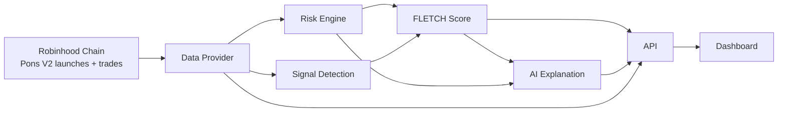
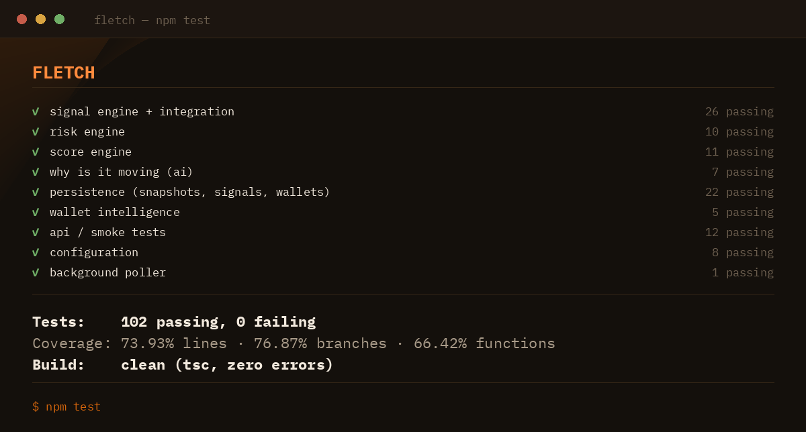

<p align="center">
  
</p>

<p align="center">
  
  
  
  
  
  
  
</p>

<p align="center"><b>The meme moves first. FLETCH tells you why.</b></p>

---

Meme tokens on Robinhood Chain launch by the thousand, and most of what "moves" is noise. FLETCH is the intelligence layer that reads the chain directly — launches, trades, holders, liquidity, deployer behavior — and turns it into three plain-English answers: what's happening, why, and whether it's worth your attention. Every number is either a real chain read or explicitly marked `unavailable`. Nothing here is a fabricated demo dressed up as a live product.

FLETCH is **not** a token screener, a trading bot, an AI chatbot, or a price predictor. There is no execution path in this repository.

## What is FLETCH?

A discovery feed, a risk engine, and an explanation layer, all reading the same source of truth: Pons V2 launch and trade events on Robinhood Chain.

| The problem | What FLETCH does |
|---|---|
| Hundreds of new tokens a day, most of them noise | Ranks by **FLETCH Score** — an explainable blend of momentum, liquidity, holders, and safety — not by market cap |
| "Is this a bundle / bot / bot-farm launch?" | Reads the launch transaction itself: dev-buy %, wallets exempted from the opening snipe tax, serial-deployer count — see [docs/RISK.md](./docs/RISK.md) |
| "Why is this moving right now?" | A templated explanation built directly from the structured numbers FLETCH computed — never a free-form model call touching raw data — see [docs/SIGNALS.md](./docs/SIGNALS.md) |
| Dashboards that quietly fake the numbers they can't get | Smart Money and Social components render `UNAVAILABLE` with a stated reason instead of a plausible-looking guess — see [docs/DATA.md](./docs/DATA.md) |
| "Trust me, it's risky" | Every risk finding names its evidence — `top 10 holders own 82%`, not `high risk` |

## How it works



Full breakdown, including why the data-provider boundary exists and what it unlocks later: [docs/ARCHITECTURE.md](./docs/ARCHITECTURE.md).

## Early Signals

The discovery feed scans the Pons V2 factory for every `TokenLaunched` event and ranks by FLETCH Score — not market cap, not recency. Age, dev-buy %, risk level, and score all come from the same real chain reads.

```
TOKEN       AGE     DEV BUY   RISK      FLETCH SCORE
```
*(shape shown — see [Live Data](#live-data) below; this repo doesn't ship fabricated rows to fill that table in.)*

Details on what counts as a signal today: [docs/SIGNALS.md](./docs/SIGNALS.md).

## Signal Engine

Beyond the discovery feed, FLETCH runs a real signal engine (`src/signals/signalEngine.ts`) that detects buy/sell pressure, whale moves classified against the token's own curve address, and — once snapshot history exists — holder growth, liquidity change, price movement, and activity acceleration. Every signal has a type, severity, confidence, exact evidence, and a plain explanation; trend signals never fire without a real previous snapshot to compare against. History accumulates from a small SQLite persistence layer (`node:sqlite`, no new runtime dependency) written to on every token-page read and, optionally, by a background poller. The dashboard's **Signals** tab shows the live, chain-wide feed — events worth attention, not a token list. Full breakdown: [docs/SIGNALS.md](./docs/SIGNALS.md).

## FLETCH Score

Six components, each either a real number or an explicit `null` with a reason. The overall score re-weights across only the components that are actually available for a given token — a token isn't punished for Smart Money and Social not existing yet.

```
DEMO — illustrative shape only, not a real token's output

$ARROWCAT                                    FLETCH SCORE   91

  MOMENTUM       96      buy pressure + activity level, since launch
  SMART MONEY    UNAVAILABLE   no cross-token wallet history store yet
  HOLDERS        91      +42% since the last check (real, once history exists)
  LIQUIDITY      82      curve balance, converted to USD
  WHALE ACTIVITY 78      3 whale buys from the curve, no sells
  SAFETY         71      inverse of the risk report
```

Exact formulas, weight re-normalization, and what "not yet a growth rate" means for Holder Growth: [docs/SCORING.md](./docs/SCORING.md).

## Why is it moving?

Every bullet traces back to a number FLETCH already computed — buy/sell counts, holder count, liquidity, risk findings. This is deliberately **not** a free-form LLM call: the safest way to guarantee the brief's "AI must never invent blockchain data" rule is to never let generated text see raw numbers and write from scratch. See `src/ai/explain.ts` and its test file for exactly what that means in code.

```
DEMO — illustrative shape only

WHY IS IT MOVING?
  18 buys vs 3 sells since launch
  312 holders tracked (lifetime)
  liquidity currently $41,800
  smart-money activity: unavailable (no wallet history store yet)

RISK
  [HIGH] top 10 holders own 61% of tracked supply
  [MEDIUM] liquidity is $41,800 — thin
```

## Risk Intelligence

`LOW` / `MEDIUM` / `HIGH` / `CRITICAL`, never a bare "SCAM." Launch-moment checks (dev buy, bundled wallets, serial deployer) plus ongoing checks (holder concentration, liquidity depth, trend-based findings). Full threshold table and what isn't checked yet (mint permissions, blacklist functions — needs bytecode analysis, not built): [docs/RISK.md](./docs/RISK.md).

## Smart Money

Not implemented as real intelligence yet — and the dashboard says so, in `src/wallets/smartMoney.ts` and on the Wallets tab, rather than shipping a leaderboard built on nothing. Real win-rate/early-entry tracking needs either a persistence layer accumulating outcomes over weeks-to-months, or an indexer with that history already built. See [docs/DATA.md](./docs/DATA.md#smart-money) for exactly what closes this gap.

## Architecture

`chain/` (raw Robinhood Chain + Pons V2 reads) → `data/` (the `ChainDataProvider` abstraction) → `persistence/` (SQLite snapshot/signal history) + `risk/` + `signals/` + `scoring/` + `ai/` (pure, unit-tested logic where possible) → `api/` (Express) → `web/` (dashboard).

The `ChainDataProvider` interface is the seam that lets a Bitquery-backed provider (unlocks post-graduation Uniswap v4 pricing, decoded trade history, wallet tracking) get swapped in later without touching scoring, risk, or the API. The signal engine (`signals/signalEngine.ts`) is a pure function over metrics + risk + an optional previous snapshot — no chain calls, no DB access, fully unit-tested. Full writeup: [docs/ARCHITECTURE.md](./docs/ARCHITECTURE.md).

## Quick Start

Every command below is a real script in [`package.json`](./package.json) — nothing here is invented.

```sh
git clone https://github.com/leopardracer/FLETCH.git
cd FLETCH
npm install
cp .env.example .env
# edit .env — at minimum, set RPC_URL (see .env.example for where to get one)
npm run dev
# open http://localhost:8787
```

`RPC_URL` is required — there's no default baked in, on purpose (see `src/core/config.ts`). Full environment variable reference and what each optional one unlocks: [docs/DEVELOPMENT.md](./docs/DEVELOPMENT.md).

## Live Data

FLETCH reads Robinhood Chain directly — no seed data, no fixtures shipped in the repo. What's real today versus what's `unavailable` and why: [docs/DATA.md](./docs/DATA.md). Short version:

**Real:** new-token discovery, launch risk signals, holder counts + whale moves, pre-graduation liquidity/price, buy/sell activity, FLETCH Score (Momentum/Liquidity/Holder Growth/Whale Activity/Safety), risk levels with evidence, persisted snapshot + signal history, trend-based signals and risk findings once history exists.

**Explicitly unavailable, not faked:** post-graduation (Uniswap v4) pricing, Smart Money win-rate/PnL (the participation record is real; PnL isn't — see [docs/DATA.md](./docs/DATA.md#smart-money)), Social signal.

## Demo

Every `DEMO`-labeled block above is illustrative shape, not real output — this repo doesn't ship a screenshot gallery built from fabricated tokens. To see real output: run [Quick Start](#quick-start) against a live `RPC_URL`, or generate real dashboard screenshots yourself with `npm run screenshot` (needs Playwright — see `scripts/screenshot.mjs` for why that's a separate install rather than a project dependency).

## Tests

<p align="center">
  
</p>

FLETCH's test suite covers the parts of the product where correctness actually matters: every FLETCH Score formula, every risk-finding threshold, every signal type the signal engine can emit, the persistence layer that backs all of it, and the API surface end-to-end over real HTTP. All of it runs deterministically — no live RPC calls, no real database file, no wall-clock timing — using Node's built-in test runner and `node:sqlite`'s in-memory mode, so a run is exact and reproducible every time.

```sh
npm test
```

```
tests 102
pass 102
fail 0
```

```sh
npm run test:coverage
```

```
all files   |  73.93 |    76.87 |   66.42 |
```

73.93% line coverage on real application code (test files themselves excluded from that number). Core business logic — signal detection, risk analysis, scoring, persistence, wallet intelligence, the "why is it moving" explainer — sits at 90–100%. The lower spots are `chain/*.ts` and `data/providers/rpcProvider.ts`, which genuinely need a live RPC connection to exercise meaningfully; per this project's own rule against fabricating chain data, those aren't mocked into a false 100%. See [docs/DEVELOPMENT.md](./docs/DEVELOPMENT.md#tests) for the full breakdown and the reasoning file by file.

```sh
npm run test:integration   # the two test files that exercise multiple layers together —
                            # chain metrics → risk → score → signals → persistence, and a
                            # real Express app over real HTTP
npm run test:watch         # re-runs on every change to the compiled output
```

## Development

Setup, environment variables, and the current next-steps list: [docs/DEVELOPMENT.md](./docs/DEVELOPMENT.md).

```sh
npm run dev
```

Type-checks, builds, and starts the API + dashboard. `npm run build` does the first two only.

## Roadmap

Priority order, detailed in [docs/DEVELOPMENT.md](./docs/DEVELOPMENT.md#next-steps):

1. Verify the Blockscout provider against a live API key; wire it into the feed to cut per-token RPC round-trips
2. Thread each token's launch timestamp into the signal engine so activity acceleration compares against a true baseline, not just the last snapshot
3. Evaluate Bitquery for Uniswap v4 pricing and decoded trade history — a provider swap, not a rewrite
4. Record price-at-trade in wallet activity — the specific piece blocking real Smart Money PnL/win-rate
5. Decide on a social data source, or keep it honestly unavailable
6. Wallet-clustering detection off existing transfer data
7. Batch per-launch RPC calls in the feed endpoint via multicall

## Built on

| Source | What was used |
|---|---|
| [docs.robinhood.com/chain](https://docs.robinhood.com/chain/) | RPC endpoint, chain ID, network model |
| [Bitquery's Pons launchpad docs](https://docs.bitquery.io/docs/blockchain/robinhood/pons-api/) | cross-verification for the Pons V2 contract addresses and event signatures |
| [Blockscout](https://robinhoodchain.blockscout.com) | official Robinhood Chain explorer; optional holder-count acceleration API |

FLETCH is independent of Pons and Robinhood, refers to the network as "Robinhood Chain," and uses none of their marks.

## License

MIT — see [LICENSE](./LICENSE).
