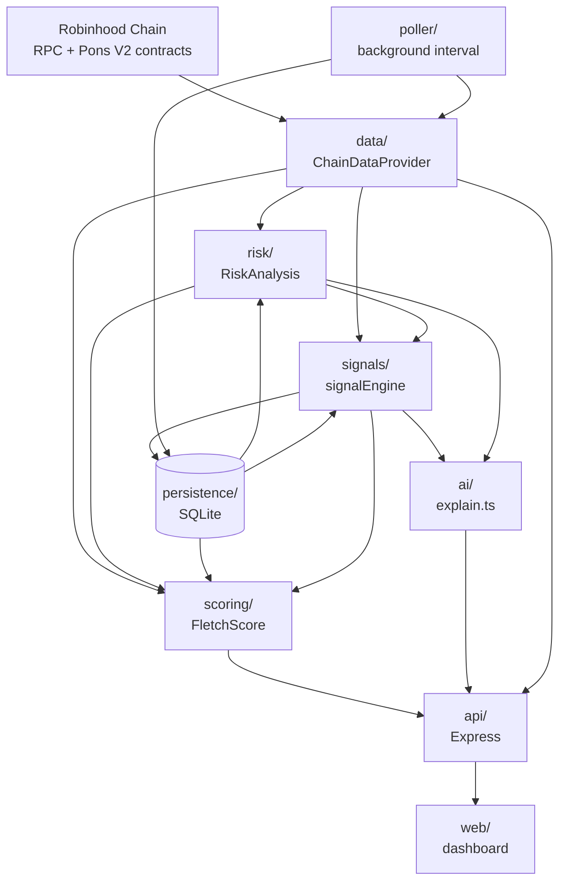

# Architecture

FLETCH is a single Node/Express service with a strict dependency direction: everything flows one way, and nothing above the data layer knows what's fetching the data underneath it.

## Layers

**`chain/`** — raw Robinhood Chain + Pons V2 reads via [viem](https://viem.sh). Ported and generalized from [GTTM](https://github.com/leopardracer/GTTM)'s sniper engine. `token.ts` caches immutable data (symbol/name/decimals) for the process lifetime — see [DEVELOPMENT.md](./DEVELOPMENT.md#performance).

**`data/`** — the `ChainDataProvider` abstraction boundary. `TokenMetrics` now carries `whaleMoves` (Phase 2) so risk/scoring/signals can all classify large transfers without a second chain read.

**`persistence/`** *(new in Phase 2)* — Node's built-in `node:sqlite`, zero extra runtime dependency. Three tables: `token_snapshots` (point-in-time metrics + score, one row per recorded check), `signals` (every detected signal, for the live feed and per-token timeline), `wallet_activity` (net token-amount change per wallet per token per timestamp — the foundation for future wallet intelligence, not the finished feature). See `db.ts`, `snapshots.ts`, `signalsStore.ts`, `walletActivityStore.ts`.

**`risk/`** — LOW/MEDIUM/HIGH/CRITICAL findings, each with a stable `code` and stated evidence. Phase 2 added trend-based findings (liquidity deterioration, abnormal sell pressure) that read a previous snapshot, and a point-in-time whale-dumping finding from `TokenMetrics.whaleMoves`.

**`signals/`** *(new in Phase 2)* — `signalEngine.ts` is a pure function: `(metrics, risk, previousSnapshot, curveAddress?, now?) → Signal[]`. No chain calls, no DB access, no implicit clock reads — fully unit-testable with fixtures (`signalEngine.test.ts`). `signalService.ts` is the impure orchestration layer: fetches the previous snapshot, calls the pure engine, persists the new snapshot and every detected signal. This is the one place a chain-metrics read becomes risk + score + signals + persisted history — both the API and the poller call it, so a page view and a poll tick produce identical, comparable results.

**`wallets/`** and **`social/`** — `smartMoney.ts` and `social.ts` remain honest stubs (`available: false` with a reason). `walletScore.ts` *(new)* exposes what Phase 2's `wallet_activity` table actually supports today — a real participation record — while keeping win-rate/PnL/holding-period as explicit `NOT_YET_IMPLEMENTED`, not a fabricated proxy score.

**`scoring/`** — the FLETCH Score. Phase 2 added a real Whale Activity component and upgraded Holder Growth to a true percentage once snapshot history exists. See [SCORING.md](./SCORING.md).

**`ai/`** — `explain.ts` now builds "why is it moving" directly from the `Signal[]` array the signal engine produced, instead of re-deriving bullets from raw metrics independently. Same non-negotiable rule as before: templated rendering of already-computed numbers, never a free-form model call touching raw data.

**`poller/`** *(new in Phase 2)* — `poller.ts` runs `analyzeAndPersist` on an interval across the most recently launched tokens, so snapshot/signal history accumulates continuously instead of only when someone opens a token page. Off if `RPC_URL` is unset; otherwise on by default with a conservative interval — see [DEVELOPMENT.md](./DEVELOPMENT.md).

**`api/`** — Express routes, plus static-hosting the dashboard in `web/`.

## Why this shape

The product brief's core requirement — real data over fabricated demos, and every unavailable metric shown as unavailable — is easiest to guarantee at a boundary. `ChainDataProvider`'s types make `null` a first-class value everywhere a metric might not exist. `signalEngine.ts` being pure means every signal's correctness is a unit test, not a manual chain-call verification. And routing risk findings through a stable `code` (rather than parsing evidence strings) means the signal engine can't silently drift out of sync with what the risk engine actually checks.
