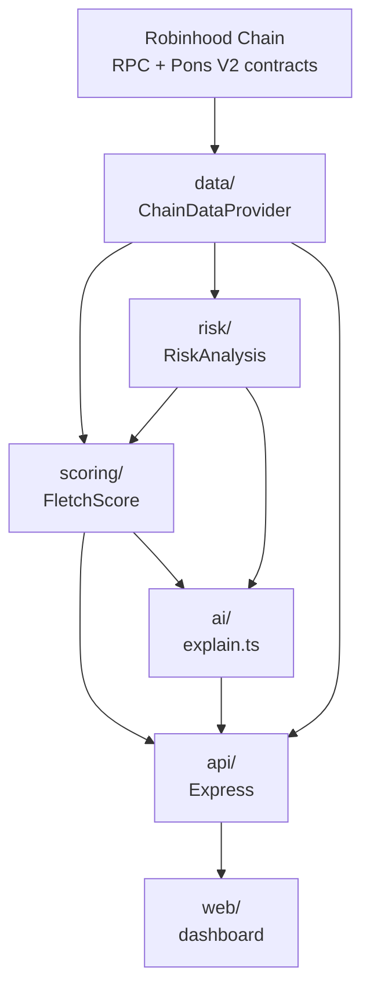

# Architecture

FLETCH is a single Node/Express service with a strict dependency direction: everything flows one way, and nothing above the data layer knows what's fetching the data underneath it.

## Layers

**`chain/`** — raw Robinhood Chain + Pons V2 reads via [viem](https://viem.sh). Ported and generalized from [GTTM](https://github.com/leopardracer/GTTM)'s sniper engine, which verified the Pons V2 factory/curve addresses and event signatures against Bitquery's docs and live chain occurrence. GTTM was hard-wired to one token; every function here takes a token address as a parameter instead.

**`data/`** — the abstraction boundary. `data/types.ts` defines `ChainDataProvider`, a five-method interface (`getNewTokens`, `getTokenMetrics`, `getTransfers`, `getHolders`, `getWalletActivity`). `data/providers/rpcProvider.ts` implements it against raw RPC — always correct, but O(logs) per call. `data/providers/blockscoutProvider.ts` is an optional accelerator for holder counts, written against Blockscout's documented API shape but not exercised against a live key in this environment (see [DATA.md](./DATA.md)).

Everything above this layer — risk, scoring, AI explanation, the API — depends only on the types in `data/types.ts`, never on viem or a specific provider. A future Bitquery-backed provider (unlocks post-graduation Uniswap v4 pricing, decoded trade history, cross-token wallet tracking) implements the same interface and gets swapped in at the one place `RpcChainDataProvider` is instantiated (`src/api/server.ts`) — nothing else in the codebase changes.

**`risk/`** — turns launch-event data and live metrics into `LOW`/`MEDIUM`/`HIGH`/`CRITICAL` findings, each with a stated piece of evidence. Never a bare label.

**`wallets/`** and **`social/`** — currently honest stubs. Both return an explicit `unavailable: true` with a reason rather than a plausible-looking fake number. See [DATA.md](./DATA.md) for what each actually needs.

**`scoring/`** — the FLETCH Score. Combines risk (safety), and live metrics (momentum, liquidity, holder count) into a single 0–100 number, weighting only the components that are actually available for a given token. See [SCORING.md](./SCORING.md).

**`ai/`** — `explain.ts` renders the "why is it moving?" bullets. This is templated string generation from structured numbers FLETCH already computed, not a free-form model call — the safest way to guarantee the "AI must never invent blockchain data" rule holds is to never let free text generation see raw numbers and write from scratch.

**`api/`** — Express routes, plus static-hosting the dashboard in `web/`.

## Why this shape

The product brief's core requirement — real data over fabricated demos, and every unavailable metric shown as unavailable rather than guessed — is easiest to guarantee at a boundary, not by convention scattered through the codebase. `ChainDataProvider`'s types make `null` a first-class value everywhere a metric might not exist, and `SmartMoneyReport`/`SocialReport` are discriminated unions (`available: true | false`) so the compiler — not a code review — catches a call site that forgot to handle the unavailable case.
